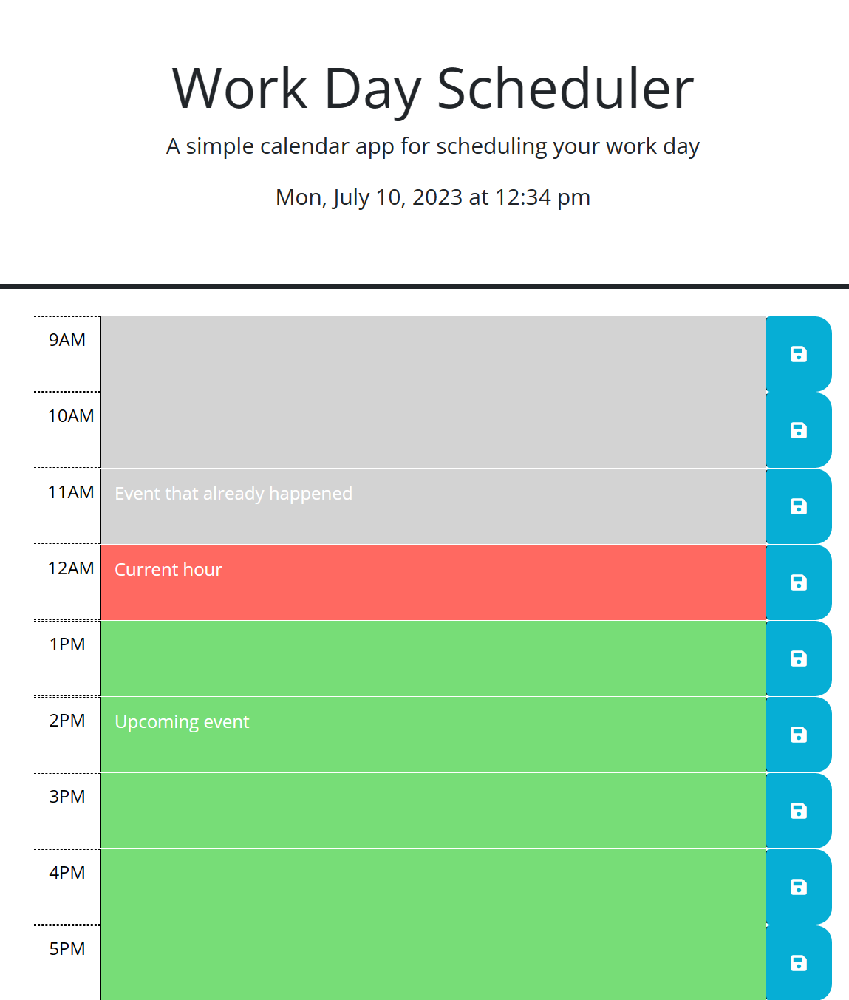

# Third-Party APIs: Work Day Scheduler

## Table of Contents

- [Description](#description)
- [Code Languages](#code-languages)
- [Installation](#installation)
- [Usage](#usage)

## Description

The purpose of this project is to create a simple calendar application that allows a user to be able to save events for each hour of a typical working day (9am&ndash;5pm) by modifying the given starter code. This app will run in the browser and feature dynamically updated HTML and CSS powered by jQuery.

## Code Languages

- HTML
- CSS
- JavaScript

## Installation

- Not required.
- You can view the screenshot or live website in the Usage section, below.

## Usage

To use the application,
- Visit the website at (https://skhai77.github.io/work-day-scheduler)
- Then, you will see the current day is displayed at the top of the calendar
- Then, you will be presented with timeblocks for standard business hours of 9am&ndash;5pm
- When you view the timeblocks for that day
- You will see that each timeblock is color coded to indicate whether it is in the past, present, or future
- Then you can enter an event by clicking into a timeblock and save it
- Then, the text for that event is saved in local storage
- When you refresh the page the saved events persist/ will stay remain

Preview the homepage:

